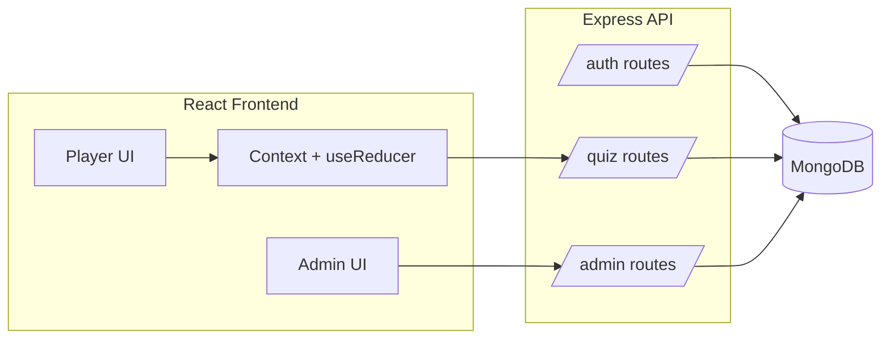

# MERN Quiz Game (Assignment Skeleton)

本仓库提供一个符合题目技术约束的**可运行基础骨架**（MERN + JWT + RBAC + Admin CRUD + Bulk Import + Dark Mode + 统一 API envelope）。

## Chosen Variation: Category-based question banks

本项目从题目允许的 4 个变体中选择 **「分类题库（Category-based）」** 作为唯一启用的变体：

- 每道题可挂一个 `category`（如 General / Science / History）。
- Player 端 `/quiz` 页先选分类，再随机抽 6–10 道题作答。
- Admin 端在创建/编辑题目和 Bulk Import 时可设置 `category` 字段。
- 后端 `GET /api/quiz/categories` 返回所有现存分类供前端构建选择页。

`Question` schema 仅保留 `category` 这一个变体字段，其他先前预留的字段（`imageUrl` / `explanation` / `timeLimitSec`）已移除以避免混淆。

## Tech Stack

- **Backend**: Node.js, Express, MongoDB, Mongoose, JWT
- **Frontend**: React (Vite), React Router, Context + `useReducer`
- **Forms**: React Hook Form + Zod
- **Security**: Helmet, rate limiting, mongo sanitize

## Project Structure

```
quiz-game/
  backend/
  frontend/
  docs/individual-reflections/
```

## Setup

### Backend

1. 复制环境变量：

```bash
cp backend/.env.example backend/.env
```

2. 启动 MongoDB（本地或 Atlas），并设置 `MONGODB_URI`。
3. 运行后端：

```bash
cd backend
npm install
npm run dev
```

后端默认在 `http://localhost:4000`，健康检查：`/api/health`。

### Frontend

1. 复制环境变量（可选；不复制时默认连本机 `http://localhost:4000/api`）：

```bash
cp frontend/.env.example frontend/.env
```

   在 `frontend/.env` 里设置 **`VITE_API_BASE_URL`**（末尾带 **`/api`**）。连线上后端时改为 Render 地址，例如 `https://xxx.onrender.com/api`。部署 **Cloudflare Pages** 时在对应项目的 **Environment variables（构建环境）** 里配置同名变量；纯静态 Workers 若无法添加变量，需在本地带环境变量执行 `npm run build` 后再上传产物。

2. 运行前端：

```bash
cd frontend
npm install
npm run dev
```

前端默认在 `http://localhost:5173`。

## API Envelope (Mandatory)

所有 API 返回统一结构：

```json
{ "success": true, "data": { } }
```

或

```json
{ "success": false, "error": "message" }
```

## Auth & Roles

- 登录成功返回 JWT：`{ token, user }`
- 受保护接口要求 `Authorization: Bearer <token>`
- Admin 接口双重限制：
  - 前端路由限制
  - 后端 `requireAuth` + `requireAdmin` middleware 限制

## Architecture (Mermaid)



## Next Steps (你们接下来要做的)

- **完善 Quiz mechanics**：题目随机洗牌、6–10 题、提交后不可改、保存 answers 列表
- **增强安全/健壮性**：更严格输入校验、错误提示、边界情况
- **补充文档**：OpenAPI/Swagger 或 Postman export、团队分工、commit 链接

