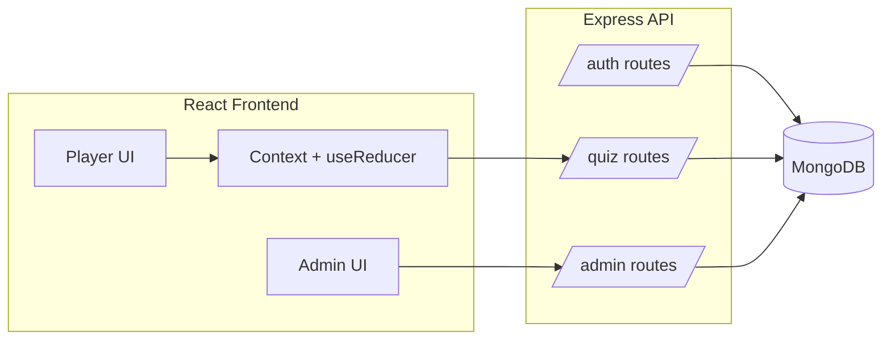

# MERN Quiz Game (Assignment Skeleton)

本仓库提供一个符合题目技术约束的**可运行基础骨架**（MERN + JWT + RBAC + Admin CRUD + Bulk Import + Dark Mode + 统一 API envelope）。

> 重要：你们必须从题目允许的 4 个变体中**选择且仅选择 1 个**，并在 README 明确写出并在演示中展示。当前骨架在 `Question` 模型里为多种变体预留了字段，但你们最终提交时应只“启用并解释一种”。

## Tech Stack

- **Backend**: Node.js, Express, MongoDB, Mongoose, JWT
- **Frontend**: React (Vite), React Router, Context + `useReducer`
- **Forms**: React Hook Form + Zod
- **Security**: Helmet, rate limiting, mongo sanitize

## Project Structure

```
quiz-game/
  backend/
  frontend/
  docs/individual-reflections/
```

## Setup

### Backend

1. 复制环境变量：

```bash
cp backend/.env.example backend/.env
```

2. 启动 MongoDB（本地或 Atlas），并设置 `MONGODB_URI`。
3. 运行后端：

```bash
cd backend
npm install
npm run dev
```

后端默认在 `http://localhost:4000`，健康检查：`/api/health`。

### Frontend

1. 复制环境变量：

```bash
cp frontend/.env.example frontend/.env
```

2. 运行前端：

```bash
cd frontend
npm install
npm run dev
```

前端默认在 `http://localhost:5173`。

## API Envelope (Mandatory)

所有 API 返回统一结构：

```json
{ "success": true, "data": { } }
```

或

```json
{ "success": false, "error": "message" }
```

## Auth & Roles

- 登录成功返回 JWT：`{ token, user }`
- 受保护接口要求 `Authorization: Bearer <token>`
- Admin 接口双重限制：
  - 前端路由限制
  - 后端 `requireAuth` + `requireAdmin` middleware 限制

## Architecture (Mermaid)



## Next Steps (你们接下来要做的)

- **确定并实现 1 个变体**（例如：分类题库 / 图片题 / 计时题 / 结束后 review）
- **完善 Quiz mechanics**：题目随机洗牌、6–10 题、提交后不可改、保存 answers 列表
- **完善 Admin**：Edit（目前只做了 Create/Toggle/Delete，Update API 已有但 UI 未做）
- **增强安全/健壮性**：更严格输入校验、错误提示、边界情况
- **补充文档**：OpenAPI/Swagger 或 Postman export、团队分工、commit 链接

